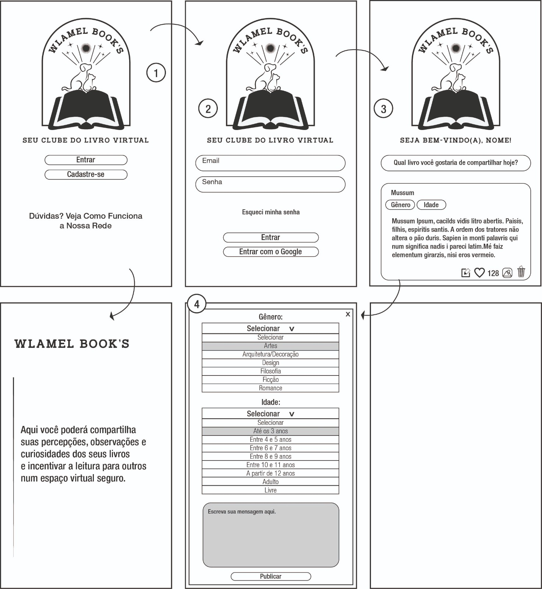
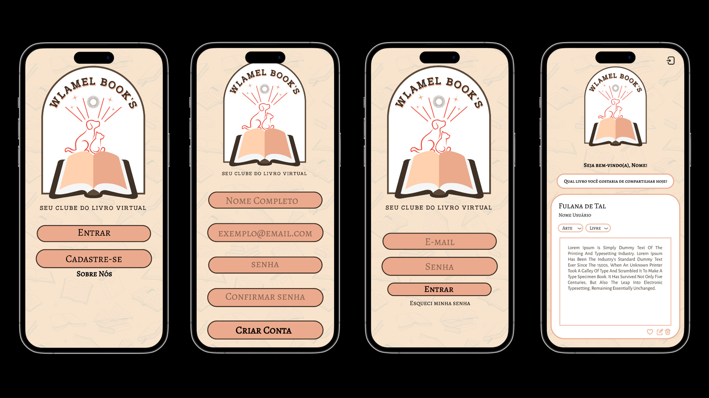

# <h1 align="center"> [Social Network — Wlamel](https://catarinaeudoxia.github.io/SAP010-data-lovers/) </h1>

  

## Índice

* [1. Prelúdio](#1-prelúdio)
* [2. Visão geral do projeto](#2-visão-geral-do-projeto)
* [3. Objetivos](#3-objetivos)
* [4. Protótipos](#4-protótipos)
* [5. Critérios de aceitação e hacker edition alcançados](#5-critérios-de-aceitação-e-hacker-edition-alcançados)
* [6. Ferramentas e mecanismos usados](#6-ferramentas-e-mecanismos-usados)
* [7. Checklist](#7-checklist)
* [8. PokeStop aqui](#8-wlamel-aqui)
* [9. Projeto desenvolvido por](#9-projeto-desenvolvido-por)

***

## 1. Prelúdio

O projeto Social Network foi elaborado com o propósito de aprimorar nossas habilidades e aplicar os conhecimentos adquiridos durante o bootcamp da Laboratória. Nosso principal objetivo neste projeto foi a construção de uma rede social, a WlaMel Book's, que permitisse qualquer usuário criar uma conta de acesso, logar-se com ela, criar, editar, dar likes e deletar publicações. Para construção da nossa página utilizamos diversas técnicas, inclçuindo a construção de uma Single-page Application (SPA) responsiva (com mais de uma tela/ página) na qual seja possível ler e escrever dados, além do trabalho colaborativo no GitHub. Tudo isso foi realizado a partir de um arquivo de dados fornecido pela Laboratória, proporcionando uma experiência prática e enriquecedora.

## 2. Visão geral do projeto

Em nosso emocionante projeto, fomos apresentadas a uma variedade de temas interessantes, mas escolhemos criar uma rede social para leitores onde usuários pudessem compartilhar e discutir sobre os livros lidos, como num clube do livro. 

Com determinação e dedicação, aprendemos a trabalhar com a construção de uma SPA onde fizemos uma janela modal em algumas página, utilizando funções, parâmetros, map, filter, sort e cálculo agregado. Além disso, mergulhamos no mundo do Git colaborativo, onde pudemos trabalhar em equipe e aprender com cada passo dado.

Embora sejamos iniciantes na programação, estamos animados para compartilhar os resultados de nossos esforços. Buscamos criar uma experiência envolvente, despertando a curiosidade e a paixão pelos Pokémons. Queremos que todos possam se divertir ao explorar as características de cada criatura, conectar pessoas apaixonadas por esse mundo e oferecer uma interface interativa que proporciona uma imersão única.

Estamos empolgadas para tê-lo(a) ao nosso lado nessa incrível jornada como programadoras em desenvolvimento!

## 3. Objetivos

O projeto possui um objetivo principal e objetivos opcionais que podem ser escolhidos para guiar nossa estratégia de trabalho. Confira abaixo:

### Objetivo Principal

- O objetivo principal de aprendizagem deste projeto é construir uma Single-page Application (SPA) responsiva (com mais de uma tela/ página) na qual seja possível ler e escrever dados.

 
### Objetivos Opcionais

- Criar posts com imagens.
- Procurar usuários, adicionar e excluir "amigos".
- Definir a privacidade de *posts* (público ou apenas para amigos).
- Permitir ver na linha do tempo de usuários "não amigos" apenas os posts públicos.
- Permitir comentar ou responder a uma postagem.
- Editar perfil.
 
## 4. Histórias do Usuário
1. **Registro e Login:**
   - Os usuários podem criar uma conta ou fazer login usando e-mail e senha.
   - A interface deve incluir avisos quando campos estiverem vazios.
   - Informações sobre a finalidade da rede social são fornecidas aos usuários.

2. **Publicações e Feed:**
   - Os usuários podem criar publicações sobre os livros que estão lendo.
   - Um feed permite aos usuários ver todas as publicações de outros leitores.

3. **Edição e Exclusão de Publicações:**
   - Os usuários podem editar e deletar suas próprias publicações.

4. **Curtir Publicações:**
   - Os usuários podem "curtir" as publicações de outros usuários.

5. **Gênero e Classificação Etária:**
   - Os usuários podem adicionar informações sobre o gênero do livro que estão lendo e sua classificação etária.

6. **Imagens nas Publicações:**
   - Os usuários podem adicionar imagens às suas publicações.

7. **Filtragem por Gênero e Classificação Etária:**
   - Os usuários podem usar filtros para navegar pelas publicações de acordo com seus interesses em gêneros e classificações etárias.

### Definição de Pronto

- O código segue a guia de estilos e passou por revisão de design.
- O código está disponível no repositório do projeto.
- O código foi testado e passou nos testes necessários.
- Parte do código foi desenvolvida em pair programming e/ou passou por revisão de código.
- A história de usuário implementada foi testada com, pelo menos, 3 usuários, e melhorias identificadas no teste de usabilidade foram incorporadas.
- O código está completo, refatorado, segue um formato padrão, está bem comentado, passou pela revisão de código e foi devidamente inspecionado.
- A aceitação do código foi testada.
- O projeto está publicado no Github Pages.

## 5. Protótipos

### Protótipo de Baixa Fidelidade

### Protótipo de Alta Fidelidade

## 6. Critérios de aceitação e hacker edition alcançados

Critérios mínimos de aceitação do projeto:

 [✔] Ter Boilerplate;

 [✔] Definição do produto;

 [✔] Histórias de usuário;

 [✔] Ser uma SPA;

 [✔] Ser responsivo;

 [✔] Receber code review de pelo menos uma parceira de outra equipe.

 [✔] Fazer testes manuais buscando erros e imperfeições simples.

 [✔] Fazer testes de usabilidade e incorporar o feedback dos usuários como melhorias.

 [✔] Fazer deploy do aplicativo e marcar a versão (git tag).

 [✔] Desenho da Interface de Usuário (protótipo de baixa fidelidade).

 [✔] Considerações sobre o comportamento da Interface do Usuário.

 [✔] Considerações técnicas sobre front-end.

 [✔] Considerações técnicas UX  .

 

## 7. Ferramentas e Mecanismos usados:

— HTML

— CSS

— JavaScript

— VSCODE

— Figma

— Canva

— Git bash

— Node.js

— Jest

— Notion
 
— Firebase (Firestore e Authentication)

— Vite

## 8. Checklist

[✔] Usar VanillaJS.
[✔] Passa pelo linter (npm run pretest)
[✔] Passa pelos testes (npm test)
[✔] Inclui uma definição de produto clara e informativa no README.md.
[✔] Inclui histórias de usuário no README.md.
[✔] Inclui rascunho da solução (protótipo de baixa fidelidade) no README.md.
[✔] UI: É responsivo.
[✔] É uma SPA.
[✔] É responsivo.
[✔] Login com Firebase (login, cadastro e postagens)
[✔] O usuário deve poder criar uma conta de acesso ou autenticar-se com conta de e-mail e senha e também com uma conta do Google.
[✔] Somente usuários com contas válidas têm acesso permitido.
[✔] Não haver usuários repetidos.
[✔] A conta do usuário deve ser um email válido.
[✔] O que o usuário digita no campo de senha (_input_) deve ser secreto.
[✔] Quando o formulário de registro ou login é enviado, ele deve ser validado.
[✔] Se houver erros, mensagens descritivas devem ser exibidas para ajudar o usuário.

# 9. Wlamel aqui:

### Aproveite a parada e de uma olhada na nossa [PokeStop](https://catarinaeudoxia.github.io/SAP010-data-lovers/)! 

 

# 10. Projeto desenvolvido por:
 

  <table>
    <tr>
      <td align="center">
        <a href="#">
           
          
            <b>Cibelli M. do Monte</b>
          
        </a>
      </td>
      <td align="center">
        <a href="#">
            
          
            <b>Catarina Eudoxia Ferreira</b>
          
        </a>
      </td>
    </tr>
  </table>

